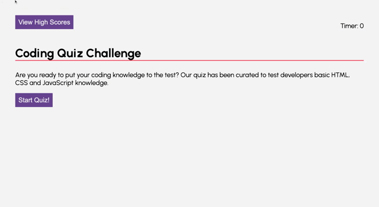

# Code Quiz - Homework # 4 

## Project Description
Websites was designed to test the knowledge of new coding students. The website features: 
- Quiz Timer 
- Multiple Choice Questions that when selected will check for correctness 
- Ability to save scores 
- High score page to see leaders 

### Built With 
- HTML 
- CSS 
- Javascript 

### Files & Directories 
- index.html
- style.css
- script.js 

## Example of Functionality 

## INstructions 
1. Fork and clone repository
2. Create directory under /develop
3. Add static content to /develop
4. Commit changes to repository
5. Deploy repository to hosting service

## Checkout the Live Version of the Site
[Code Quiz](https://ashleyviola.github.io/code-quiz/)

## Editor Information 
Created and maintained by Ashley Viola